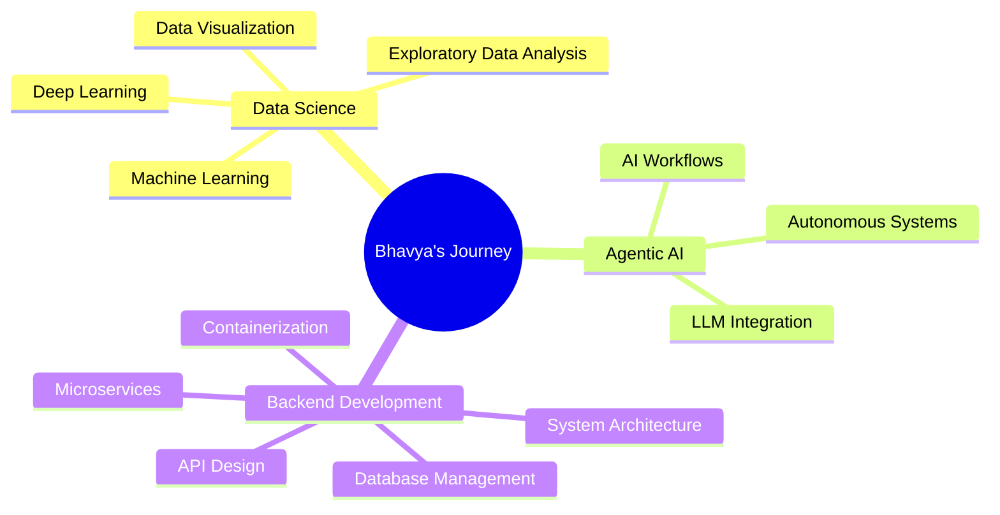

# Hey there! 👋 Welcome to my GitHub universe

<div align="center">
  
</div>

<div align="center">
  
  [](https://my-portfolio-5rq6-delta.vercel.app/)
  [](https://www.linkedin.com/in/bhavya-jha-52461b250/)
  [](mailto:bhavyajha1404@gmail.com)
  
</div>

---

## 🚀 About Me

```python
class BhavyaJha:
    def __init__(self):
        self.name = "Bhavya Jha"
        self.role = "Final-Year Computer Science Student"
        self.specialization = "Data Science"
        self.current_focus = [
            "Agentic AI", 
            "Backend Development", 
            "Cloud Technologies"
        ]
        self.philosophy = "Make code that matters, not just works"
        
    def get_daily_activities(self):
        return [
            "🔭 Exploring new AI frameworks and algorithms",
            "🌱 Learning best practices and modern development patterns",
            "💡 Building projects that solve real problems",
            "📚 Contributing to open-source when possible"
        ]
        
    def future_goals(self):
        return "Planning to dive into Go lang soon! 🐹"
```

--- 

<div align="center">

### Areas of Interest


</div>

---

## 📊 GitHub Analytics

<div align="center">
  
</div>

<div align="center">
  
</div>

<div align="center">
  
</div>

---

## 🎯 Current Focus Areas



---

## 💭 Random Dev Quote

<div align="center">
  
</div>

---

## 🤝 Let's Connect and Collaborate!
  
  I'm always excited to connect with fellow developers, data enthusiasts, and anyone passionate about technology!
  
  **Open for:**
  - 🤝 Collaboration on interesting projects
  - 💡 Discussing new ideas and innovations
  - 🎓 Learning opportunities and mentorship
  - 🚀 Open source contributions
  
  <br/>
  
  [](https://my-portfolio-5rq6-delta.vercel.app/)
  
  <br/>
  
  **"Code is like humor. When you have to explain it, it's bad."** *– Cory House*]

---

<div align="center">
  
  
  ⭐️ From [Bhavya Jha](https://github.com/04bhavyaa)
